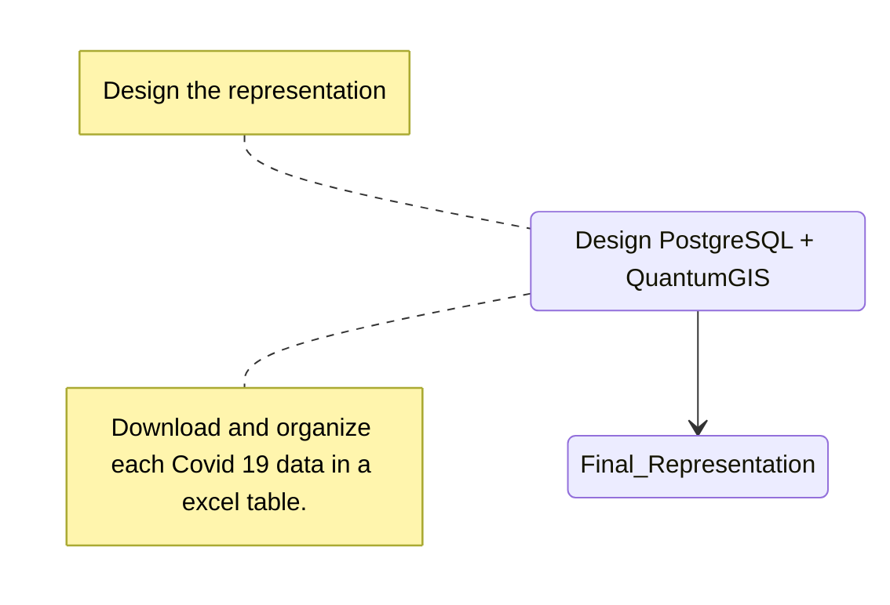

# COVID-19 Mapping Project

It is with great satisfaction that I share the closure of the COVID-19 map project that I developed!
It was an incredible journey developing since 2021 a tool that visualized the evolution of cases on an interactive map.

A database was developed to store this data and then connected to the QuantumGIS environment, it was possible to update the information just by typing the day of publication of the data. After that, it was enough just to update the data and the map is automatically represented using the previously created layout.
    

        

    

<figure markdown="span">
  
  
  
  <figcaption>Covid 19 Mapping</figcaption>
</figure>
Thank you to everyone who followed and supported this project!
